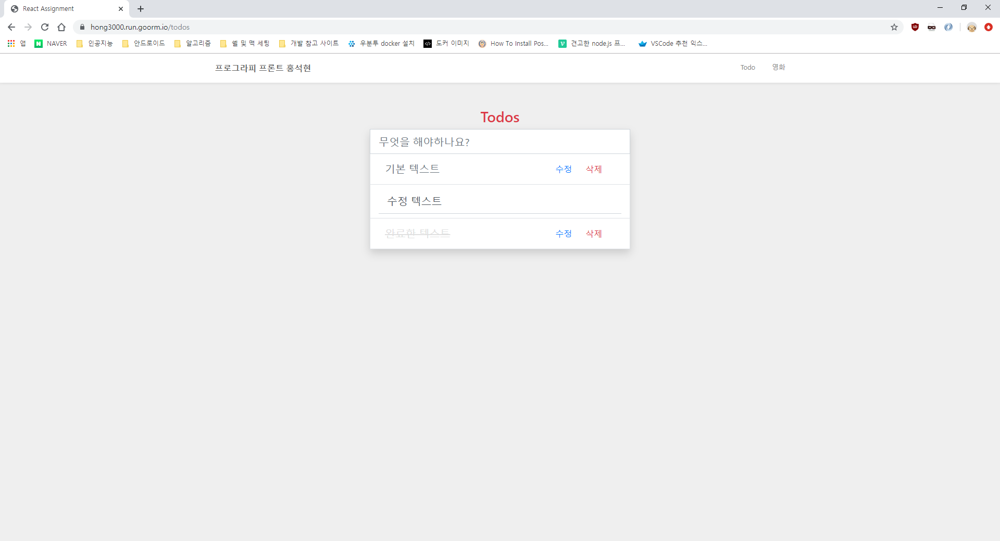

### `yarn start`

Runs the app in the development mode. 
Open [http://localhost:3000](http://localhost:3000) to view it in the browser.

### Todo

Todo list.

### Loading

Before load movie list, there is indicator.

### MovieList

Movie list with just plain text.

